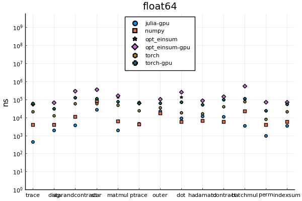

# OMEinsum-Benchmarks

This repository is used to compare the performance of `einsum` in python (`numpy`, `torch`), with implementations in `julia`.

In `/pythonscripts`, the benchmarking-scripts for `numpy.einsum` and `torch.einsum` can be found.
The tested operations and the sizes of the arrays involved are:

| label | description | `einsum`-equation | small | medium | large|
| --- | --- |---| --- | --- | --- |
| `matmul`| matrix multiplication | `ij,jk -> ik` | 10×10 | 100×100 | 1000×1000 |
| `dot`| dot product | `ijl,ijl->` | 10×10×10 | 20×20×20 | 50×50×50 |
| `ptrace`| partial trace | `iij->j` | 10×10×10 | 20×20×20 | 50×50×50 |
| `hadamard`| the hadamard product | `ijk,ijk->ijk` | 10×10×10 | 30×30×30 | 50×50×50 |
| `tcontract`| tensor contraction | `ikl,kjl->ij`| 2×2×2 | 10×10×10 | 30×30×30 |
| `indexsum`| summing over a (single) index | `ijk->ik` | 10×10×10 | 30×30×30 | 100×100×100 |
| `trace`| matrix-trace | `ii->` | 10×10 | 100×100 | 1000×1000|
| `diag`| taking the diagonal w.r.t to two or more indices | `jii->ji`| 10×10×10 | 20×20×20 | 50×50×50 |
| `starandcontract`| mixing tensor and star-contraction | `ij,il,il->j` | 10×10 | 30×30 | 100×100 |
| `star`| starcontracting over a single index | `ij,ik,il->jkl`| 10×10 | 30×30 | 100×100 |
| `outer`| taking the outer product between two tensors | `ij,kl->ijkl` | 10×10 | 50×50 | 100×100 |
| `batchmul`| batchmultiplying two batches of matrices | `ijl,jkl->ikl` | 10×10×3 | 100×100×3 | 1000×1000×3 |
| `perm`| permuting a tensors indices | `ijkl->ljki` | 2×2×2×2 |10×10×10×10 |30×30×30×30 |

The benchmarks have been evaluated over inputs of different size,
labelled (ad-hoc) as `tiny`, `small`, `medium`, `large` and `huge`.
The current benchmark has been run with `torch`, `numpy` for python and
`OMEinsum.jl` and `Einsum.jl` for julia.

# Overview
The plots are split by the memory footprint of the operations,
i.e. by size size of the tensors involved which have been classified as tiny, small, medium, large or huge
rather arbitrarily.
The results below are for tensors of type `float64` but
more results can be found in the `plots/` folder.
Generally, changing to `float32` or complex types does not change
the picture too much, except that torch does not support complex numbers.

## small tensors

## medium tensors

## large tensors

