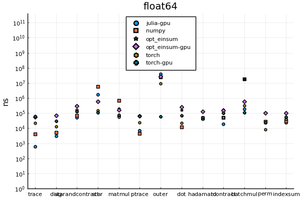
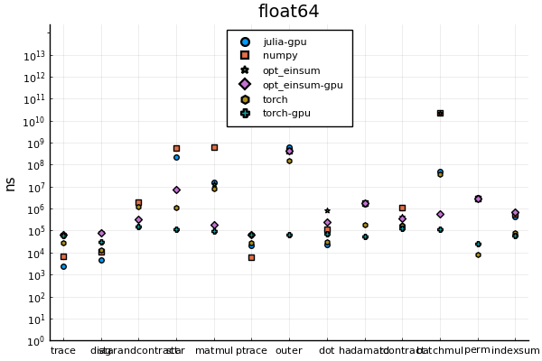

# OMEinsum-Benchmarks

This repository is used to compare the performance of `einsum` in python (`numpy`, `torch` and `tensorflow`), with implementations (WIP) in `julia`.

In `/pythonscripts`, the benchmarking-scripts for `numpy.einsum` and `torch.einsum` can be found.
The tested operations are:

| label | description | `einsum`-equation |
| --- | --- |---|
| `matmul`| matrix multiplication | `ij,jk -> ik`
| `dot`| dot product | `ijl,ijl->`
| `ptrace`| partial trace | `iij->j`
| `hadamard`| the hadamard product | `ijk,ijk->ijk`
| `tcontract`| tensor contraction | `ikl,kjl->ij`
| `indexsum`| summing over a (single) index | `ijk->ik`
| `trace`| (pairwise) tracing all indices | `ii->`
| `diag`| taking the diagonal w.r.t to two or more indices | `jii->ji`
| `starandcontract`| mixing tensor and star-contraction | `ij,il,il->j`
| `star`| starcontracting over a single index | `ij,ik,il->jkl`
| `outer`| taking the outer product between two tensors | `ij,kl->ijkl`
| `batchmul`| batchmultiplying two batches of matrices | `ijl,jkl->ikl`
| `perm`| permuting a tensors indices | `ijkl->ljki`

The benchmarks have been evaluated over inputs of different size,
labelled (ad-hoc) as `tiny`, `small`, `medium`, `large` and `huge`.
The current benchmark has been run with `torch`, `numpy` and some naive implementations
in plain `julia` with the aim of just implementing all functions,
without generality or speed in mind.

So far, this whole document is mainly a placeholder.

# Overview

